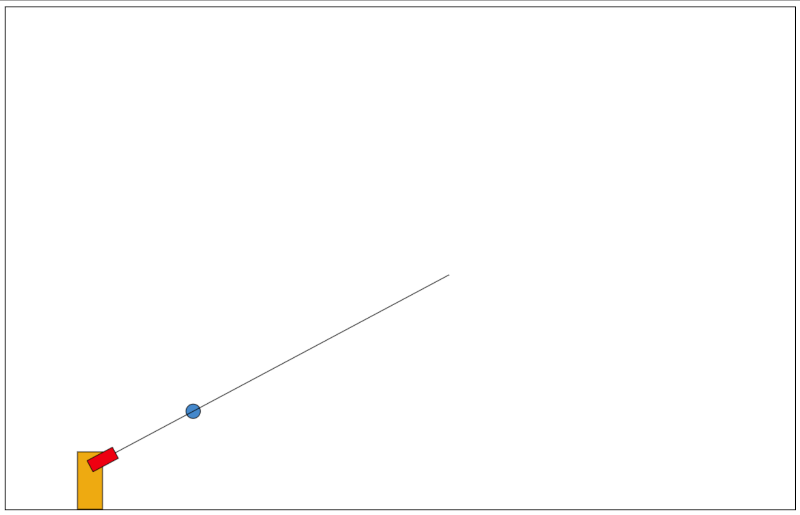

# Experimental Game Project

  

This project is an experimental game. It is a small browser-based game developed using **HTML**, **CSS**, and **JavaScript**. The player controls a character that can move, shoot projectiles, and perform double jumps. The game does not have a specific objective and is designed as a fun, experimental environment.

## Features

- **Character Movement**: Use q and d to move the character left or right.
- **Double Jump**: Press the spacebar twice to perform a double jump.
- **Aim and Shoot**: Use the mouse to aim and shoot in any direction.

## Technologies Used

- **HTML**: For structuring the game interface.
- **CSS**: For styling the game elements.
- **JavaScript**: For implementing the game logic and interactions.

## How to Play

1. Clone the repository or download the project files.
2. Open `shooter.html` in your preferred browser.

Have fun !
